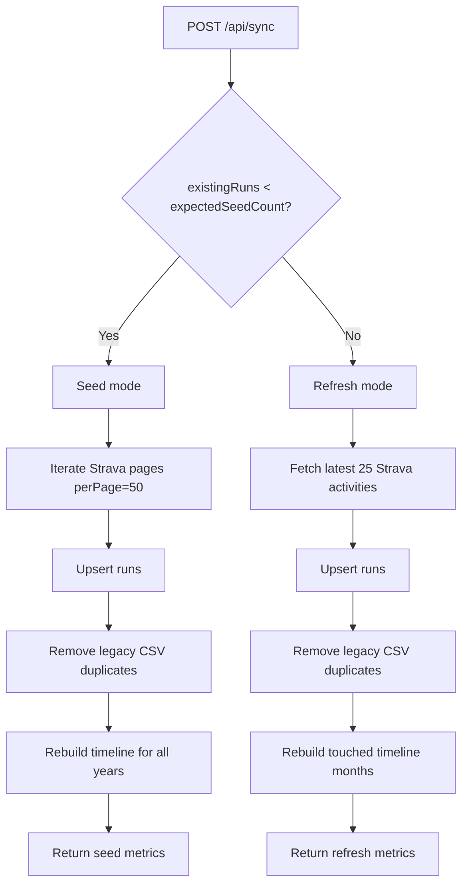

# Run Blog Next APIs and Background Processes

## Overview
This app exposes local Next.js App Router APIs under `app/api/*` and uses a browser-side data layer (`lib/api.ts`) for retries, caching, and cache invalidation after sync.

## API Routes

### `GET /api/activities`
- Purpose: Fetch latest Strava activities directly from Strava (limit 50).
- Params: none.
- Success response: array of normalized activities.
- Error response:
  - `429` with `{ "error": "Unable to load activities" }` when the thrown error message includes `rate limit exceeded`.
  - `500` with `{ "error": "Unable to load activities" }` for other failures.
- CORS: `OPTIONS /api/activities` returns `204` with standard CORS headers.

### `GET /api/runs`
- Purpose: Return all runs from the `Runs` table ordered by `startDate desc`.
- Params: none.
- Success response: `RunActivity[]`.
- Error response: `500` with `{ "error": "Unable to load runs" }`.
- CORS: `OPTIONS /api/runs` returns `204` with standard CORS headers.

### `GET /api/runs/feed`
- Purpose: Cursor-paginated runs feed used by homepage stats and `/runs` infinite scroll.
- Query params:
  - `limit` (optional integer; normalized to 1..96 in service layer, default 24)
  - `cursor` (optional base64url cursor)
- Success response:
  - `runs: RunActivity[]`
  - `nextCursor: string | null`
  - `totalRuns: number`
  - `totalDistanceKm: number`
- Error response: `500` with `{ "error": "Unable to load runs" }`.
- CORS: `OPTIONS /api/runs/feed` returns `204` with standard CORS headers.

### `GET /api/timeline`
- Purpose: Year-specific 12-month timeline summary.
- Query params:
  - `year` (optional integer, defaults to current year)
- Success response:
  - `year: number`
  - `months: TimelineMonthSummary[12]`
- Error response: `500` with `{ "error": "Unable to load timeline" }`.
- Notes: service first reads `TimelineData`; if that fails, it falls back to aggregating from `Runs`.
- CORS: `OPTIONS /api/timeline` returns `204` with standard CORS headers.

### `POST /api/sync`
- Purpose: Sync runs from Strava and refresh timeline summary data.
- Modes:
  - `seed`: if `countRuns() < STRAVA_EXPECTED_ACTIVITY_COUNT` (default 101), iterates Strava pages (`perPage=50`), upserts runs, deduplicates legacy CSV rows, rebuilds full timeline years.
  - `refresh`: otherwise fetches latest 25 activities, upserts, deduplicates, rebuilds touched timeline months only.
- Success response includes mode-specific metrics (`fetched`, `inserted`, `updated`, `timelineMonthsRebuilt`, etc.).
- Error response:
  - `429` with `{ "error": "Unable to sync runs" }` when thrown error message includes `rate limit exceeded`.
  - `500` with `{ "error": "Unable to sync runs" }` otherwise.

### `GET /api/sync`
- Purpose: Explicitly disabled.
- Response: plain text `Not found` with status `404`.

### `OPTIONS /api/sync`
- Purpose: CORS preflight.
- Response: `204` with standard CORS headers.

### `GET /api/test`
- Purpose: Basic backend health/debug route.
- Success response:
  - `message: "Backend is working!"`
  - `timestamp: string`
  - `env` flags (`hasClientId`, `hasClientSecret`, `hasRefreshToken`)
- CORS: `OPTIONS /api/test` returns `204` with standard CORS headers.

### `GET /api/blog/views`
- Purpose: Return blog view counters for Blogeshwar blog cards.
- Query params:
  - `slugs` (optional comma-separated blog slugs)
- Success response:
  - `success: true`
  - `views: Array<{ slug: string; title: string; views: number }>`
- Error response: `500` with `{ success: false, message: "Server error. Please try again later." }`.
- CORS: `OPTIONS /api/blog/views` returns `204` with standard CORS headers.

### `POST /api/blog/views/track`
- Purpose: Increment one blog post view counter.
- Request body:
  - `slug: string` (required)
  - `title: string` (required)
- Success response:
  - `success: true`
  - `slug: string`
  - `views: number`
- Validation response:
  - `400` with `{ success: false, message: "Slug is required" }` or `{ success: false, message: "Title is required" }`
- Error response: `500` with `{ success: false, message: "Server error. Please try again later." }`.
- CORS: `OPTIONS /api/blog/views/track` returns `204` with standard CORS headers.

## Shared HTTP/CORS Behavior
All `jsonResponse`, `textResponse`, and `optionsResponse` include:
- `Access-Control-Allow-Origin: *`
- `Access-Control-Allow-Methods: GET, POST, PUT, DELETE, OPTIONS`
- `Access-Control-Allow-Headers: Content-Type, Authorization`
- `Access-Control-Max-Age: 86400`

## Browser Data Layer (`lib/api.ts`)

### Retry Policy
- `requestJson` retries only retryable failures:
  - network `TypeError`
  - HTTP `500+`, `429`, `408`
- Default retries: `2` (total up to 3 attempts).
- Backoff delay: `250ms * attempt`.
- `syncLatestRuns()` disables retry (`retries: 0`) because it is POST with side effects.

### Browser Cache Keys and TTL
- `run_blog:runs_all` -> all runs (`fetchRuns`) TTL 60s
- `run_blog:runs_feed:limit=<n>:cursor=<cursor>` -> paginated feed TTL 60s
- `run_blog:timeline_year:<year>` -> timeline summary TTL 5m
- On `syncLatestRuns()` success, runs and timeline cache keys are invalidated.

## Background Processes

### Timeline Auto Retry in UI
`Section3.tsx` auto-retries timeline load failures up to 3 attempts with increasing delay, then leaves manual retry available.

### Timeline-First Warmup Pipeline
After initial `2026` timeline data is loaded, homepage starts one-time non-blocking warmups:
- preload `2025` timeline summary
- prefetch `/runs` route
- warm first runs page (`limit=24`) cache

Warmup errors are logged only and never shown in UI.

### Runs Page Background Recovery
`Runs.tsx` auto-recovers initial load and infinite-scroll failures with delayed retries and online-event retries.

## Data Flow Diagram

```mermaid
flowchart TD
  A[Homepage mounts] --> B[Section3 load selected year]
  B --> C[GET /api/timeline?year=2026]
  C --> D[Timeline rendered]
  D --> E[One-time background warmup]
  E --> F[GET /api/timeline?year=2025]
  E --> G[router.prefetch('/runs')]
  E --> H[GET /api/runs/feed?limit=24]
  F --> I[Timeline cache updated]
  H --> J[Runs feed cache warmed]
```

## Sync Pipeline Diagram


